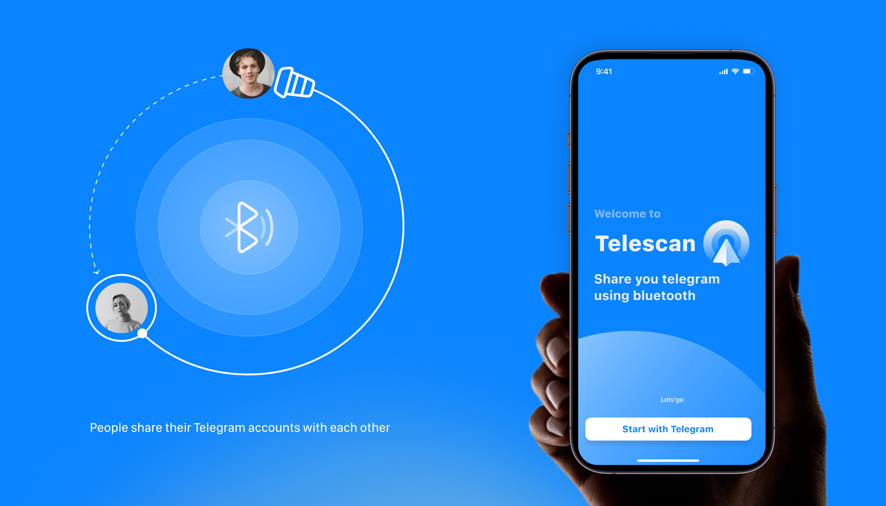
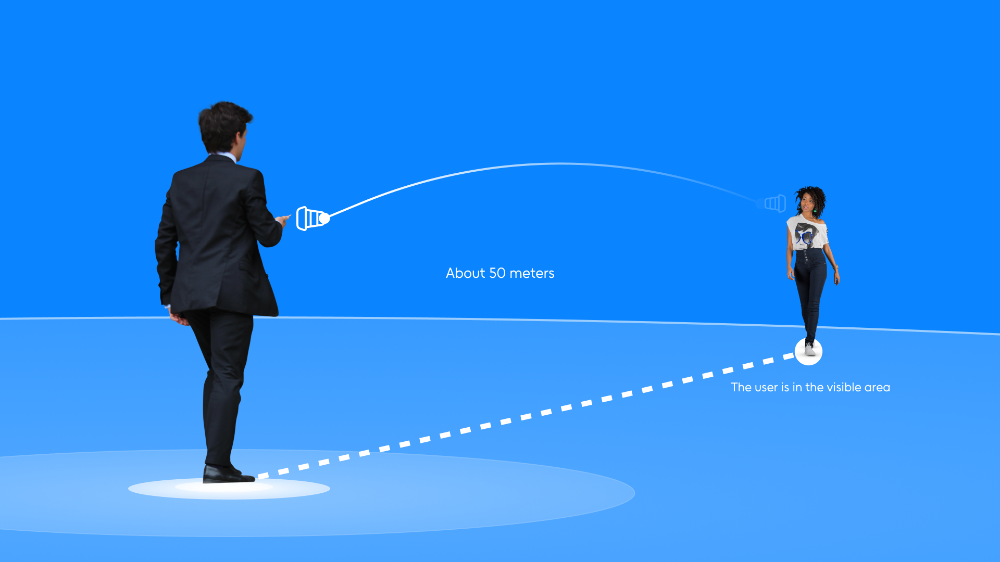
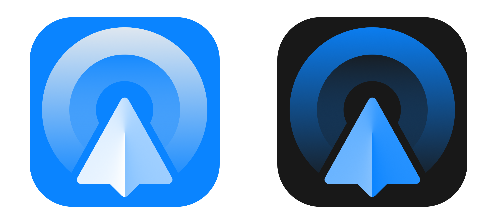

# Telescan

[](https://swift.org)
[](https://developer.apple.com/ios/)
[](https://opensource.org/licenses/MIT)



Telescan is an iOS app that allows users to find people nearby and connect with them through their Telegram profiles using Bluetooth Low Energy (BLE). It works as a Telegram extension, allowing secure sharing of profiles without the need for a direct Internet connection to be discovered.

\*Development also planned for Android

## Features

- **Proximity-based Discovery**: Uses BLE to detect nearby users with Telegram profiles
- **Telegram Integration**: Linking to existing Telegram accounts
- **Privacy-First**: No permanent identifiers or location tracking
- **Ephemeral Connections**: Connections exist only while devices are in range
- **Secure Authentication**: [SHA-256](https://en.wikipedia.org/wiki/SHA-2) hashed codes for profile verification
- **Distance Estimation**: [RSSI](https://en.wikipedia.org/wiki/Received_signal_strength_indicator)-based approximate distance calculation

## Data transmitted



Data is being transmitted to the user in the visible area of the device.

### Logo



The Telescan logo represents a stylized Telegram paper plane emitting a signal, symbolizing nearby discovery and connection.

- **Light Theme**: Designed for light backgrounds
- **Dark Theme**: Designed for dark backgrounds

## Architecture

Telescan consists of three main components:

### 1. Telegram Bot

- Generates unique 8-character authentication codes
- Links Telegram profiles to the mobile app

### 2. iOS Application

- **BLE Manager**: Handles Bluetooth discovery and advertising
- **Network Service**: Communicates with backend API for profile data
- **Interface**: Modern, intuitive user interface

### 3. Backend API

- RESTful API for profile management
- Secure storage of user data
- Image hosting via S3

## Requirements

- iOS 16.0+
- Xcode 15.0+
- Swift 5.9+
- Telegram account

## Installation

### For Users

1. Download Telescan from the App Store _(link will be added)_
2. Open Telegram and find [@tgtelescan_bot](https://t.me/tgtelescan_bot)
3. Start the bot and generate your authentication code
4. Open Telescan app and enter the code
5. Grant Bluetooth permissions when prompted

### For Developers

1. Clone the repository:

```bash
git clone https://github.com/hiTechTeam/Telescan-iOS.git
cd Telescan-iOS
```

2. Open `TelescaniOS.xcodeproj` in Xcode

3. Configure your backend API endpoints in `App/Configuration/Configs/AppConfig.swift`

4. Build and run on a physical iOS device (BLE requires physical hardware)

## Usage

### First Time Setup

1. **Telegram Integration**:

   - Open Telegram
   - Search for [@tgtelescan_bot](https://t.me/tgtelescan_bot)
   - Send `/start` to generate your code

2. **App Setup**:

   - Launch Telescan
   - Enter the 8-character code from Telegram
   - Confirm your profile information

3. **Enable Discovery**:
   - Toggle scanning in the main interface
   - Grant Bluetooth permissions

### Discovering People

1. Navigate to the "People" tab
2. Enable scanning
3. Nearby users with Telescan will appear automatically
4. Tap on a profile to view details and open in Telegram

### Managing Your Profile

1. Go to the "Profile" tab
2. View your current information
3. Update your profile photo if needed
4. Access app information and settings

## Project Structure

```
TelescaniOS/
├── App/
│   ├── Models/          # Data models (ProfileInfo, Requests, Responses)
│   ├── Services/        # Core services
│   │   ├── BLE/         # Bluetooth Low Energy manager
│   │   ├── NET/         # Network communication
│   │   └── Storage/     # Local data storage
│   ├── Utils/           # Utilities and extensions
│   ├── ViewModels/      # MVVM view models
│   └── Views/           # SwiftUI views and components
├── Configuration/       # App configuration and plist
├── Resources/           # Assets, colors, localization
└── TelescaniOS.xcodeproj/
```

## Key Components

### BLEManager

Handles all Bluetooth operations:

- Advertising device presence with Telegram ID
- Scanning for nearby devices
- Managing connection timeouts
- Calculating approximate distances via [RSSI](https://en.wikipedia.org/wiki/Received_signal_strength_indicator)

### FetchService

Manages network communication:

- [SHA-256](https://en.wikipedia.org/wiki/SHA-2) code hashing
- API request handling
- Profile data fetching
- Image upload functionality

### PeopleViewModel

Coordinates people discovery:

- BLE device management
- Profile caching
- Distance calculations
- User data loading

## Security

- **Code Hashing**: All authentication codes are SHA256 hashed before transmission
- **HTTPS Only**: All network communication uses TLS encryption
- **Ephemeral Data**: No persistent storage of sensitive information
- **Privacy by Design**: Minimal data collection and retention

## Privacy

Telescan is designed with privacy as a core principle:

- No location data is collected or stored
- Connections are temporary and device-only
- Profile data is fetched on-demand and cached briefly
- Users control when their device is discoverable
- No tracking or analytics

## Contributing

1. Fork the repository
2. Create a feature branch (`git checkout -b feature/amazing-feature`)
3. Commit your changes (`git commit -m 'Add amazing feature'`)
4. Push to the branch (`git push origin feature/amazing-feature`)
5. Open a Pull Request

## Development Setup

### Dependencies

- [Kingfisher](https://github.com/onevcat/Kingfisher) — Image loading and caching
- [Swift Log](https://github.com/apple/swift-log) — Structured, leveled logging
- CoreBluetooth — BLE functionality (built-in)
- SwiftUI — UI framework (built-in)

### Testing

Currently, no automated tests are implemented.

In the future, you can run tests in Xcode:

```bash
xcodebuild test -project TelescaniOS.xcodeproj -scheme Telescan
```

### Building for Release

1. Update version in `Info.plist`
2. Archive in Xcode
3. Upload to App Store Connect

## Troubleshooting

### BLE Issues

- Ensure Bluetooth is enabled in iOS Settings
- Test on physical devices (simulator doesn't support BLE)

### Network Issues

- Check internet connectivity

### Telegram Integration

- Ensure you have a Telegram username set
- Check that the generated code is entered correctly
- Verify Telegram account permissions

## License

This project is licensed under the [MIT License](./LICENSE).

## Contact

- **Developer**: [r66cha](https://github.com/r66cha)
- **Telegram**: [@ruslanrocketman1](https://t.me/ruslanrocketman1)
- **Email**: r66cha@gmail.com

---

_For detailed technical information, see [WHITEPAPER.md](./WHITEPAPER.md)_
