#Telescan Technical document

## Abstract

Telescan is a Bluetooth Low Energy (BLE) based app that allows users to find people nearby and connect with them through their Telegram profiles. It works as a Telegram extension, allowing secure profile sharing. This paper details the technical architecture, BLE discovery mechanisms, profile sharing protocols, and privacy features that enable seamless social media communication in physical proximity.

## Contents

1. [Introduction](#introduction)
2. [Architecture Overview](#architecture-overview)
3. [Bluetooth discovery](#bluetooth-discovery)
4. [Profile exchange protocol](#profile-exchange-protocol)
5. [Security and Authentication](#security-and-authentication)
6. [Privacy features](#privacy-features)
7. [Distance Estimation](#distance-estimation)
8. [User Interface Flow](#user-interface-flow)
9. [Telegram integration](#telegram-integration)
10. [Output](#output)

## Introduction

Telescan solves the problem of connecting with people in physical proximity while maintaining privacy and leveraging existing social networks. By integrating with Telegram as an extension, Telescan provides a bridge between digital identity and real-world interactions.

### Key Features

- **Proximity Based Discovery**: Uses BLE to detect nearby users.
- **Telegram integration**: seamless connection to Telegram profiles.
- **Privacy First**: No persistent IDs or location tracking.
- **Ephemeral Connections**: Connections only exist when devices are within range.
- **Secure Authentication**: [SHA-256](https://en.wikipedia.org/wiki/SHA-2) hashes for profile verification.
- **Distance Estimator**: Distance estimation based on [RSSI](https://en.wikipedia.org/wiki/Received_signal_strength_indicator).

## Architecture Overview

<div align="center">

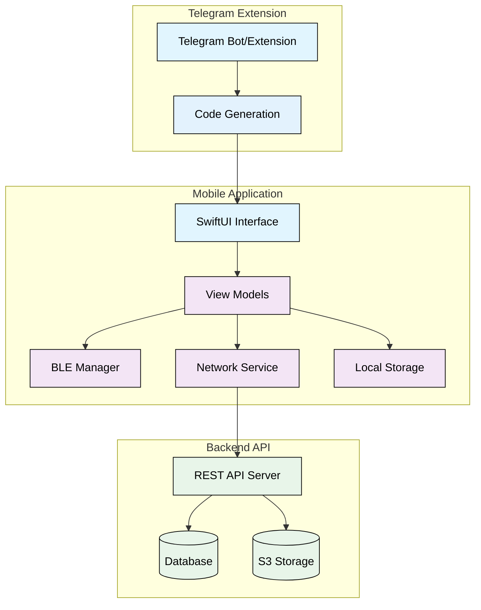

</div>

## Bluetooth Discovery

Telescan implements a BLE-based discovery system in which each user transmits their Telegram ID as an advertising ID.

### BLE Service Configuration

<div align="center">

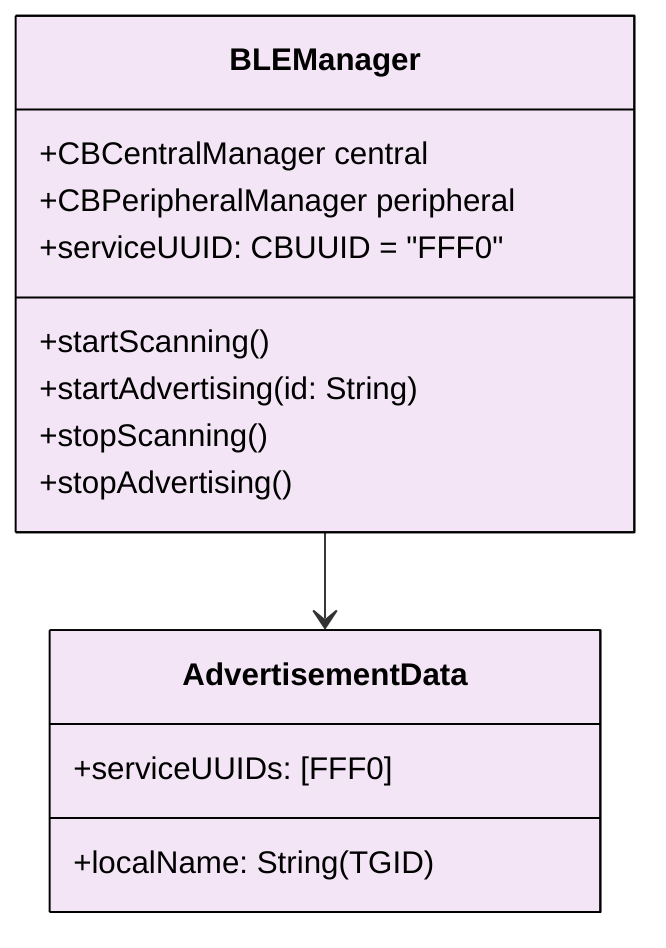

</div>

### Discovery Flow

<div align="center">

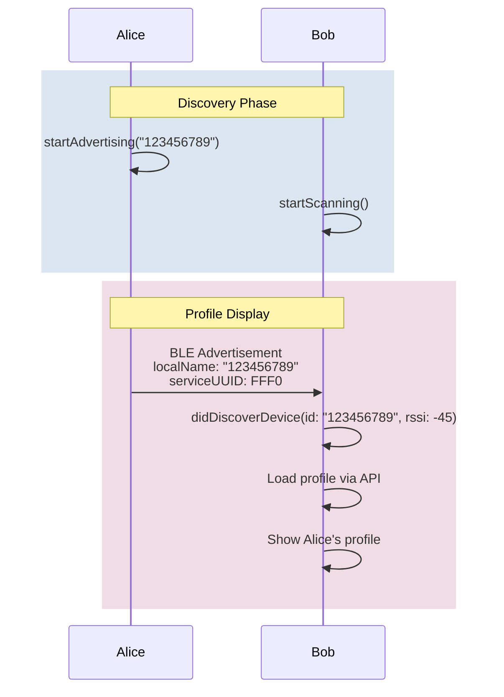

</div>

Key characteristics:

- **Service UUID**: FFF0 for Telescan-specific discovery.
- **Local name**: Telegram identifier as a string identifier.
- **No GATT services**: purely promotional discovery.
- **Timeout control**: Devices are removed after 5 seconds of no signal.

## Profile Exchange Protocol

Profile data is exchanged through a centralized API using hashed authentication codes.

### Authentication Flow

<div align="center">

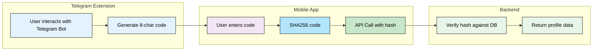

</div>

### API Methods

| Method | Purpose                      |
| ------ | ---------------------------- |
| GET    | Get user data by hashed code |
| GET    | Get user data by Telegram ID |
| POST   | Update profile photo         |

### Data Structures

<div align="center">

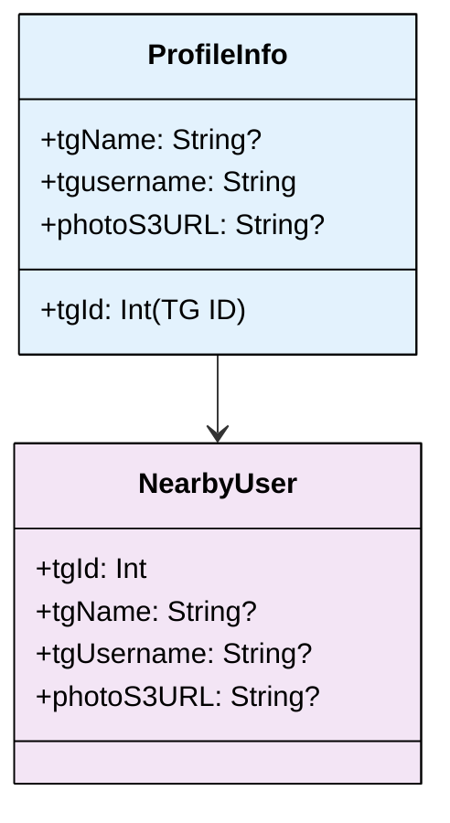

</div>

## Security and Authentication

Telescan implements multiple security layers to protect user privacy and prevent unauthorized access.

### Code Hashing

<div align="center">

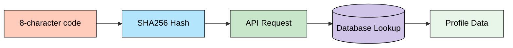

</div>

```swift
func sha256(_ input: String) -> String {
    let inputData = Data(input.utf8)
    let hashed = SHA256.hash(data: inputData)
    return hashed.compactMap { String(format: "%02x", $0) }.joined()
}
```

### Data Transmission

- **HTTPS Only**: All API communications use TLS 1.3
- **Base64 Encoding**: Profile images encoded for transmission
- **No Plaintext Storage**: Codes never stored in plaintext
- **Session-Based**: Authentication valid only during app session

## Privacy Features

Telescan prioritizes user privacy through ephemeral connections and minimal data retention.

### Ephemeral Architecture

<div align="center">

```mermaid
gantt
    title User Session Lifecycle
    dateFormat X
    axisFormat %s

    section Discovery
    BLE Scan     :done, scan, 0, 30
    Device Found :done, found, 5, 1
    Profile Load :done, load, 6, 2

    section Interaction
    View Profile :done, view, 8, 10
    Open Telegram:done, open, 15, 1

    section Cleanup
    Device Lost :done, lost, 25, 1
    Cache Clear :done, clear, 30, 5
```

</div>

### Privacy Mechanisms

1. **No Persistent IDs**: Telegram IDs used only for profile lookup
2. **Local Caching**: Profile data cached temporarily in memory
3. **No Location Data**: Only proximity detection via BLE signal strength
4. **Opt-in Sharing**: Users control when to share their presence
5. **Automatic Cleanup**: Cached data cleared when devices go out of range

### Data Minimization

<div align="center">

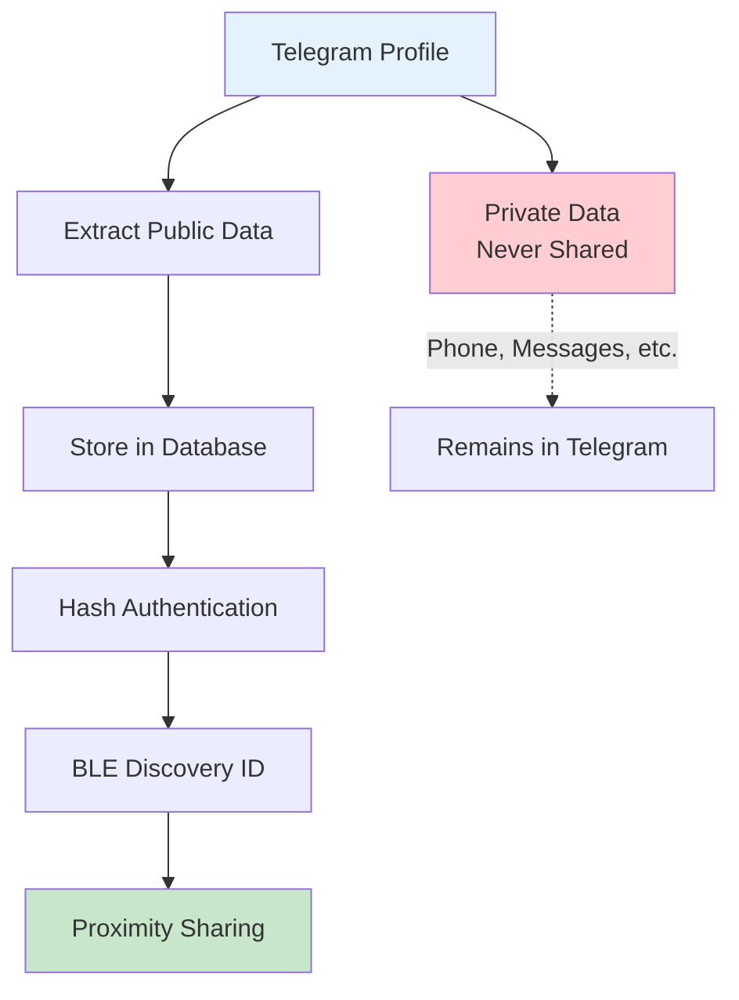

</div>

## Distance Estimation

Telescan provides approximate distance estimation using BLE [RSSI](https://en.wikipedia.org/wiki/Received_signal_strength_indicator) values.

### RSSI to Distance Conversion

<div align="center">

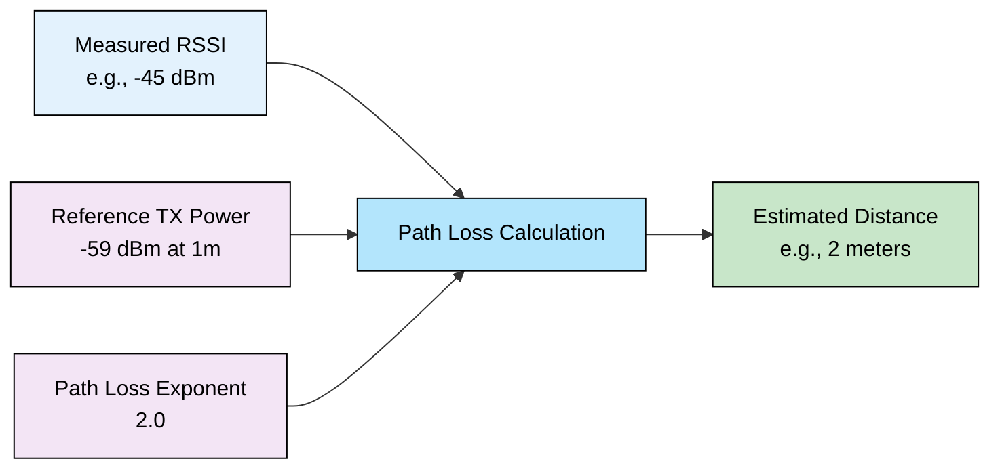

</div>

```swift
func distanceFromRSSI(
    _ rssi: Int,
    txPower: Int = -59,  // Measured power at 1 meter
    pathLossExponent: Double = 2.0  // Free space path loss
) -> Int {
    let ratio = Double(txPower - rssi) / (10 * pathLossExponent)
    let distance = pow(10.0, ratio)
    return max(1, Int(distance.rounded()))
}
```

### How Distance is Calculated

Telescan estimates the distance to another device based on the strength of the Bluetooth signal it receives:

1. **RSSI**: The device measures the signal strength (in dBm) from a nearby device. Stronger signals indicate closer proximity.
2. **TX Power**: The known transmit power at a reference distance (usually 1 meter).
3. **Path Loss Exponent**: Represents how quickly the signal weakens in the environment (2.0 for open space, higher for obstacles).
4. **Calculation**: The difference between TX Power and RSSI is adjusted by the path loss exponent to estimate distance.

**Formula (simplified):**

\[\text{distance} = 10^{\frac{\text{TX} - \text{RSSI}}{10 \cdot n}}\]

Where:

- `TX` — reference transmit power at 1 meter
- `RSSI` — measured signal strength
- `n` — path loss exponent

> This provides only an approximate distance, as walls, objects, and interference can affect the signal.

### Accuracy Considerations

- **Environmental Factors**: Walls, interference affect accuracy
- **Approximate Only**: Provides relative proximity, not precise positioning
- **Real-time Updates**: Distance recalculated every 5 seconds
- **Battery Aware**: Calculation performed only when scanning is active

## User Interface Flow

Telescan follows a streamlined user experience from Telegram integration to social discovery.

### Onboarding Flow

<div align="center">

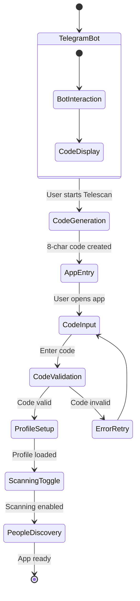

</div>

### Main Application Flow

<div align="center">

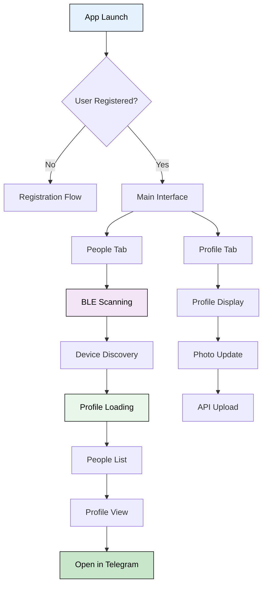

</div>

## Telegram Integration

Telescan operates as a Telegram extension, leveraging Telegram's ecosystem for user management.

### Extension Architecture

<div align="center">

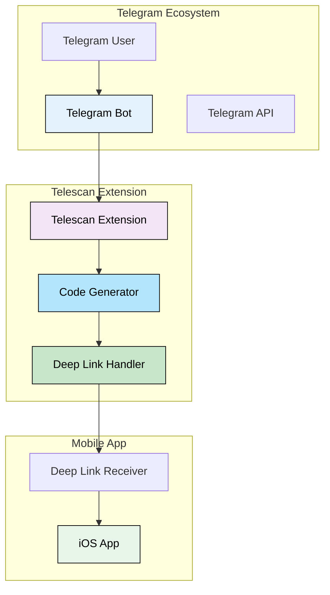

</div>

### Code Generation Process

1. **Interaction with bot**: user interacts with [@tgtelescan_bot](https://t.me/tgtelescan_bot).
2. **Code Generation**: The bot generates a unique 8-digit code.
3. **Secure Storage**: The code is hashed and stored on the server side.
4. **App Linking**: The code is displayed for manual entry in the app.
5. **Verification**: the application hashes the code and receives the profile.

## Conclusion

Telescan demonstrates how modern mobile technologies can facilitate meaningful social connections while prioritizing user privacy and security. Using Bluetooth Low Energy for proximity detection and seamlessly integrating with the Telegram ecosystem, Telescan provides an approach to social discovery.

The system design emphasizes:

- **User privacy**: temporary connections with minimal data storage.
- **Security**: cryptographic authentication without persistent credentials.
- **Simplicity**: intuitive interface that does not require complex setup.
- **Integration**: natural extension of existing social networks.
- **Efficiency**: Battery operation optimized for long-term use.

As an extension of Telegram, Telescan serves as both a practical tool for social networking and a reference implementation of proximity-based applications.

---

_This document is released into the public domain under The [MIT License](./LICENSE)._
